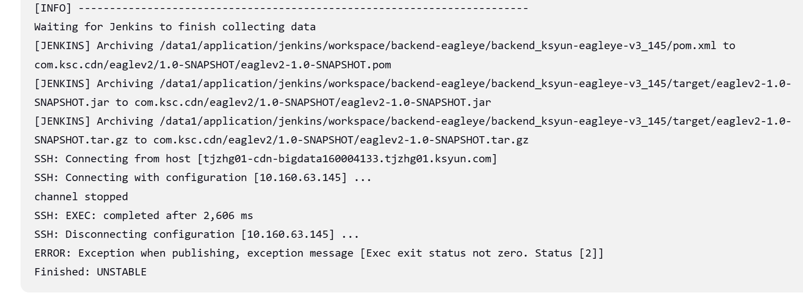
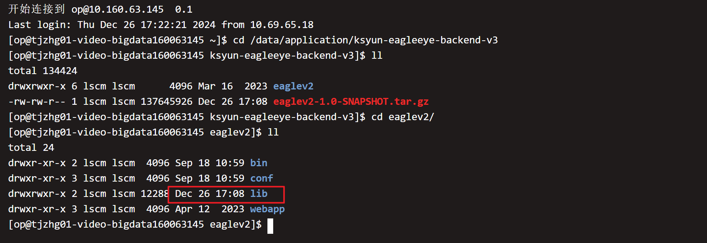
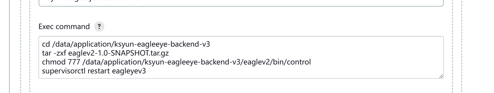
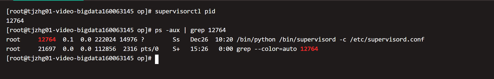
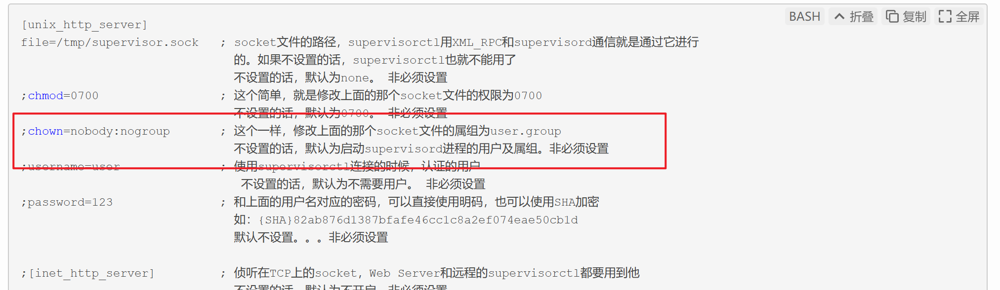

# 2024/12/26 Jenkins部署排障

一次部署v3的过程记录为unstable,  新feat没有在部署的节点上实现. 查看线上文件情况

jenkins发包成功, 打包相关库文件已经上传服务器. 

***\*可能原因:\****  lscm用户在10.160.63.145上不能使用supervisorctl指令, 但在jenkins脚本中使用

看到supervisorctl进程以root用户启动, 而配置中设置no-group

以其他用户使用supervisorctl相关指令时会因为没有socket文件权限而报错

附: jenkins常用Exec exit status not zero的问题

在Jenkins部署过程中，可能会遇到’Exec exit status not zero’的错误。这个错误通常意味着在执行某个步骤时出现了问题，导致命令或脚本执行失败。要解决这个问题，我们需要仔细检查Jenkins的[日志](https://cloud.baidu.com/product/bls.html)输出，找出导致失败的具体原因。

以下是一些可能导致’Exec exit status not zero’错误的常见原因及其解决方案：

1. 命令或脚本语法错误：检查您在Jenkins中执行的命令或脚本是否有语法错误。确保所有的参数、选项和命令都是正确的。如果使用的是shell脚本，请确保脚本中的所有命令都正确无误。
    示例：在Jenkins中执行一个shell脚本，可以使用’sh’或’bash’命令。例如：
    sh ‘your_script.sh’
    或
    bash ‘your_script.sh’
    请确保’your_script.sh’中的命令和语法都是正确的。
2. 命令或脚本依赖项未安装：如果您的命令或脚本依赖于某些特定的软件或工具，请确保这些依赖项已经在执行命令或脚本的服务器上正确安装。
    示例：如果您的脚本中使用了’npm install’命令来安装依赖项，请确保已正确安装Node.js和npm（Node包管理器）。
3. 权限问题：检查执行命令或脚本的用户是否有足够的权限来访问所需的文件和目录。有时候，权限不足会导致执行失败。
    示例：如果您的脚本需要访问一个受限制的目录，请确保执行脚本的用户具有适当的读取和写入权限。
4. 环境变量配置错误：在执行命令或脚本之前，请确保所有必要的环境变量都已正确设置。有时候，环境变量的配置错误会导致执行失败。
    示例：在Jenkins中设置环境变量，可以在构建步骤的“增加构建环境变量”选项中添加所需的变量。确保变量名和值正确无误。
5. 资源不足：如果服务器资源不足（如内存、磁盘空间等），可能会导致执行失败。请检查服务器的资源使用情况，并确保有足够的资源来执行命令或脚本。
    示例：监控服务器的资源使用情况，可以使用系统监控工具（如top、htop、df等）来检查内存、磁盘空间等资源的使用情况。

[Jenkins : Job Exit Status](https://wiki.jenkins.io/JENKINS/Job-Exit-Status.html)